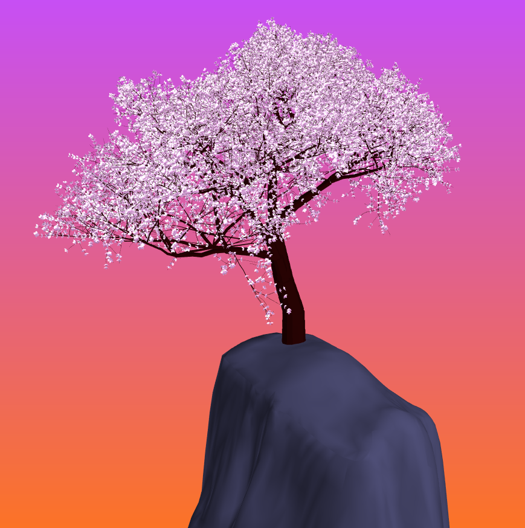
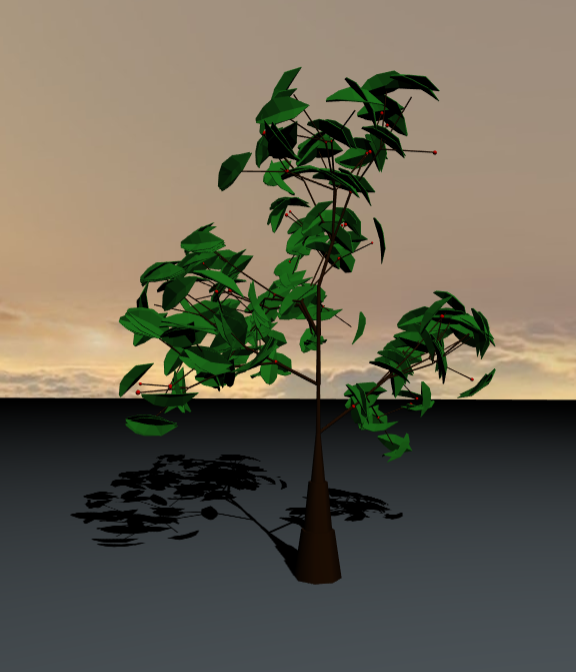
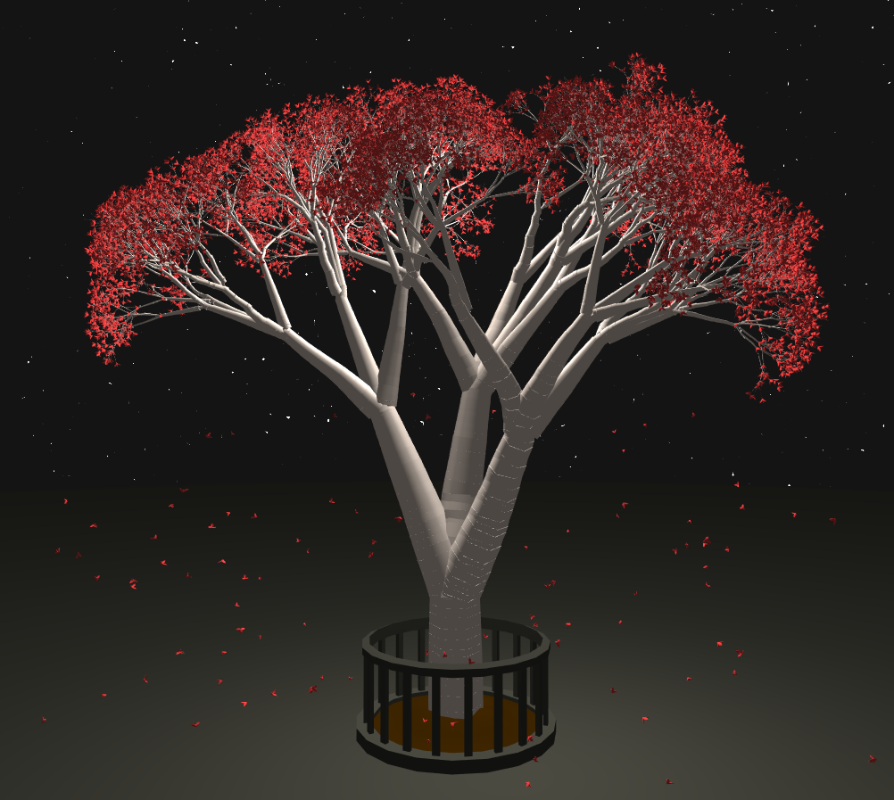

# Homework 6: City Generation

For this assignment, you will generate a collection of 3D buildings within the road networks you created for the previous assignment.

For this assignment, you will generate a network of roads to form the basis of a city using a modified version of L-systems. As in homework 4, you will be using instanced rendering to draw your road networks.

## Provided Resources
You can use any base code for this assignment, so we haven't provided
anything specific for you. We have included the paper [Real-time Procedural Generation of 'Pseudo Infinite' Cities](procedural_infinite_cities.pdf) for your reference. For visual inspiration, you might refer to Emily's [City Forgery](http://www.emilyhvo.com/city-forgery/) project.

## Assignment Requirements
- __(5 points)__ Based on the code you wrote for the previous assignment, create a 3D model of your terrain. You might consider using the subdivided plane we provided with homework 1. Since the road generation assignment was entirely 2D, your terrain need not have changes in elevation, since that would alter the placement of roads and buildings. The only elevation changes we require are having the water exist at a lower elevation than the land, with a small slope between the two.

- __(5 points)__ Using whatever visual representation you wish, draw your roads on top of your terrain model. For the simplest representation, use instanced rendering to draw rectangular prisms slightly above the ground.
- __(10 points)__ On the CPU, create a high-resolution 2D grid that spans your entire scene. "Rasterize" every road in this grid with an adjustable line thickness to demarcate areas where buildings cannot be placed. Do the same with any water in your terrain. This grid will be used in the next section to determine valid locations for buildings.
- __(10 points)__ Generate a collection of randomly scattered 2D points in your building placement validity grid, removing any points that fall within cells already occupied by roads or water. At each of these points, you will place a building generated based on the specifications in the next section.
- __(20 points)__ To create building geometry, you will follow the method illustrated in figure 3 of [Real-time Procedural Generation of 'Pseudo Infinite' Cities](procedural_infinite_cities.pdf). Beginning at a predetermined top height, generate some n-sided polygon and extrude it downward a certain distance. After creating this first layer, create an additional layer beneath it that has the form of two polygons combined together and extruded downward. Repeat until your building has reached the ground. You will be creating the structure of these buildings as VBO data on the CPU.
- __(25 points)__ Once you have the basics of building generation working, you will need to refine your algorithm to create art-directed procedural buildings. Your city should contain buildings that follow these guidelines:
  - Buildings in your city should not be uniform in appearance. The higher the city's population density, the more the buildings should resemble skyscrapers. In areas of lower density, the buildings should be shorter and look more residential. Think office buildings versus row homes. Areas of medium population should contain buildings that are of medium height and which look more like multi-story offices or shops. Don't feel constrained by the building generation algorithm from the previous section; add slanted roofs and other features to your buildings if you wish.
  - The texturing of your buildings should be procedurally generated within a shader. Use all of the techniques you practiced in the first three homework assignments to polish your buildings' appearances. The overall aesthetic of your city is up to you (e.g. cyberpunk versus modern versus renaissance) but the procedural texturing should look intentional. Include windows, doors, lights, and other details you deem necessary to make your buildings look natural.
- __(10 points)__ Make use of artistic lighting as we discussed during the environmental setpiece assignment. You should include several directional lights, as discussed in [IQ's article on artistic lighting](http://iquilezles.org/www/articles/outdoorslighting/outdoorslighting.htm), to ensure your scene has adequate illumination. There should never be any purely black shadows in your scene.
- __(5 points)__ Your scene should include a procedural sky background as so many of your other assignments have. Make sure it is congruent with your lighting setup and the aesthetics of your city.
- __(10 points)__ Following the specifications listed
[here](https://github.com/pjcozzi/Articles/blob/master/CIS565/GitHubRepo/README.md),
create your own README.md, renaming the file you are presently reading to
INSTRUCTIONS.md. Don't worry about discussing runtime optimization for this
project. Make sure your README contains the following information:
    - Your name and PennKey
    - Citation of any external resources you found helpful when implementing this
    assignment.
    - A link to your live github.io demo (refer to the pinned Piazza post on
      how to make a live demo through github.io)
    - An explanation of the techniques you used to generate your L-System features.
    Please be as detailed as you can; not only will this help you explain your work
    to recruiters, but it helps us understand your project when we grade it!


## Extra Credit (Up to 20 points)
- If you did not do so for the previous assignment, implement additional road layouts as described in Procedural Modeling of Cities
  - Radial road networking: The main roads follow radial tracks around some predefined centerpoint
  - Elevation road networking: Roads follow paths of least elevation change
- Use shape grammars to further refine the structure of your buildings
- Create fully 3D terrain and adjust the placement of your buildings and roads based on the slope of your terrain.
- In the vein of Emily's procedural city, use the BioCrowds algorithm to create agents that seek some goal point by navigating the terrain covered by roads. 
- Add any polish features you'd like to make your visual output more interesting
# Homework 4: L-systems

For this assignment, you will design a set of formal grammar rules to create
a plant life using an L-system program. Once again, you will work from a
TypeScript / WebGL 2.0 base code like the one you used in homework 0. You will
implement your own set of classes to handle the L-system grammar expansion and
drawing. You will rasterize your L-system using faceted geometry. Feel free
to use ray marching to generate an interesting background, but trying to
raymarch an entire L-system will take too long to render!

## Base Code
The provided code is very similar to that of homework 1, with the same camera and GUI layout. Additionally, we have provided you with a `Mesh` class that, given a filepath, will construct VBOs describing the vertex positions, normals, colors, uvs, and indices for any `.obj` file. The provided code also uses instanced rendering to draw a single square 10,000 times at different locations and with different colors; refer to the Assignment Requirements section for more details on instanced rendering. Farther down this README, we have also provided some example code snippets for setting up hash map structures in TypeScript.

## Assignment Requirements
- __(15 points)__ Create a collection of classes to represent an L-system. You should have at least the following components to make your L-system functional:
  - A `Turtle` class to represent the current drawing state of your L-System. It should at least keep track of its current position, current orientation, and recursion depth (how many `[` characters have been found while drawing before `]`s)
  - A stack of `Turtle`s to represent your `Turtle` history. Push a copy of your current `Turtle` onto this when you reach a `[` while drawing, and pop the top `Turtle` from the stack and make it your current `Turtle` when you encounter a `]`. Note that in TypeScript, `push()` and `pop()` operations can be done on regular arrays.
  - An expandable string of characters to represent your grammar as you iterate on it.
  - An `ExpansionRule` class to represent the result of mapping a particular character to a new set of characters during the grammar expansion phase of the L-System. By making a class to represent the expansion, you can have a single character expand to multiple possible strings depending on some probability by querying a `Map<string, ExpansionRule>`.
  - A `DrawingRule` class to represent the result of mapping a character to an L-System drawing operation (possibly with multiple outcomes depending on a probability).

- __(10 points)__ Set up the code in `main.ts` and `ShaderProgram.ts` to pass a collection of transformation data to the GPU to draw your L-System geometric components using __instanced rendering__. We will be using instanced rendering to draw our L-Systems because it is much more efficient to pass a single transformation for each object to be drawn rather than an entire collection of vertices. The provided base code has examples of passing a set of `vec3`s to offset the position of each instanced object, and a set of `vec4`s to change the color of each object. You should at least alter the following via instanced rendering (note that these can be accomplished with a single `mat4`):
  - Position
  - Orientation
  - Scaling

- __(55 points)__ Your L-System scene must have the following attributes:
  - Your plant must grow in 3D (branches must not just exist in one plane)
  - Your plant must have flowers, leaves, or some other branch decoration in addition to basic branch geometry
  - Organic variation (i.e. noise or randomness in grammar expansion and/or drawing operations)
  - The background should be a colorful backdrop to complement your plant, incorporating some procedural elements.
  - A flavorful twist. Don't just make a basic variation of the example F[+FX]-FX from the slides! Create a plant that is unique to you. Make an alien tentacle monster plant if you want to! Play around with drawing operations; don't feel compelled to always make your branches straight lines. Curved forms can look quite visually appealing too.

- __(10 points)__ Using dat.GUI, make at least three aspects of your L-System interactive, such as:
  - The probability thresholds in your grammar expansions
  - The angle of rotation in various drawing aspects
  - The size or color or material of the plant components
  - Anything else in your L-System expansion or drawing you'd like to make modifiable; it doesn't have to be these particular elements

- __(10 points)__ Following the specifications listed
[here](https://github.com/pjcozzi/Articles/blob/master/CIS565/GitHubRepo/README.md),
create your own README.md, renaming the file you are presently reading to
INSTRUCTIONS.md. Don't worry about discussing runtime optimization for this
project. Make sure your README contains the following information:
    - Your name and PennKey
    - Citation of any external resources you found helpful when implementing this
    assignment.
    - A link to your live github.io demo (refer to the pinned Piazza post on
      how to make a live demo through github.io)
    - An explanation of the techniques you used to generate your L-System features.
    Please be as detailed as you can; not only will this help you explain your work
    to recruiters, but it helps us understand your project when we grade it!

## Writing classes and functions in TypeScript
Example of a basic Turtle class in TypeScript (Turtle.ts)
```
import {vec3} from 'gl-matrix';

export default class Turtle {
  constructor(pos: vec3, orient: vec3) {
    this.position = pos;
    this.orientation = orient;
  }

  moveForward() {
    add(this.position, this.position, this.orientation * 10.0);
  }
}
```
Example of a hash map in TypeScript:
```
let expansionRules : Map<string, string> = new Map();
expansionRules.set('A', 'AB');
expansionRules.set('B', 'A');

console.log(expansionRules.get('A')); // Will print out 'AB'
console.log(expansionRules.get('C')); // Will print out 'undefined'
```
Using functions as map values in TypeScript:
```
function moveForward() {...}
function rotateLeft() {...}
let drawRules : Map<string, any> = new Map();
drawRules.set('F', moveForward);
drawRules.set('+', rotateLeft);

let func = drawRules.get('F');
if(func) { // Check that the map contains a value for this key
  func();
}
```
Note that in the above case, the code assumes that all functions stored in the `drawRules` map take in no arguments. If you want to store a class's functions as values in a map, you'll have to refer to a specific instance of a class, e.g.
```
let myTurtle: Turtle = new Turtle();
let drawRules: Map<string, any> = new Map();
drawRules.set('F', myTurtle.moveForward.bind(myTurtle));
let func = drawRules.get('F');
if(func) { // Check that the map contains a value for this key
  func();
}
```
TypeScript's `bind` operation sets the `this` variable inside the bound function to refer to the object inside `bind`. This ensures that the `Turtle` in question is the one on which `moveForward` is invoked when `func()` is called with no object.

## Examples from previous years (Click to go to live demo)

Andrea Lin:

[](http://andrea-lin.com/Project3-LSystems/)

Ishan Ranade:

[](https://ishanranade.github.io/homework-4-l-systems-IshanRanade/)

Joe Klinger:

[](https://klingerj.github.io/Project3-LSystems/)

Linshen Xiao:

[](https://githublsx.github.io/homework-4-l-systems-githublsx/)

## Useful Resources
- [The Algorithmic Beauty of Plants](http://algorithmicbotany.org/papers/abop/abop-ch1.pdf)
- [OpenGL Instanced Rendering (Learn OpenGL)](https://learnopengl.com/Advanced-OpenGL/Instancing)
- [OpenGL Instanced Rendering (OpenGL-Tutorial)](http://www.opengl-tutorial.org/intermediate-tutorials/billboards-particles/particles-instancing/)

## Extra Credit (Up to 20 points)
- For bonus points, add functionality to your L-system drawing that ensures geometry will never overlap. In other words, make your plant behave like a real-life plant so that its branches and other components don't compete for the same space. The more complex you make your L-system self-interaction, the more
points you'll earn.
- Any additional visual polish you add to your L-System will count towards extra credit, at your grader's discretion. For example, you could add animation of the leaves or branches in your vertex shader, or add falling leaves or flower petals.
